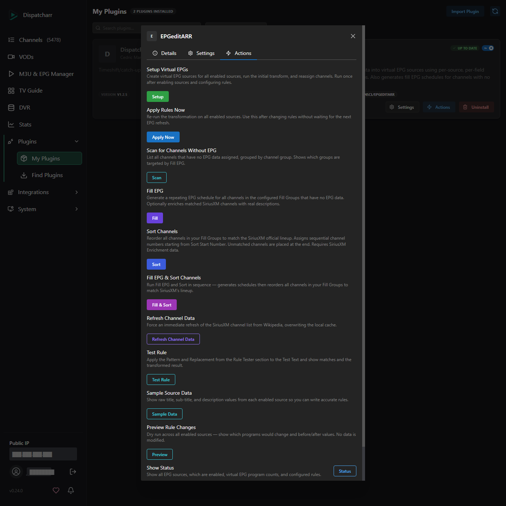
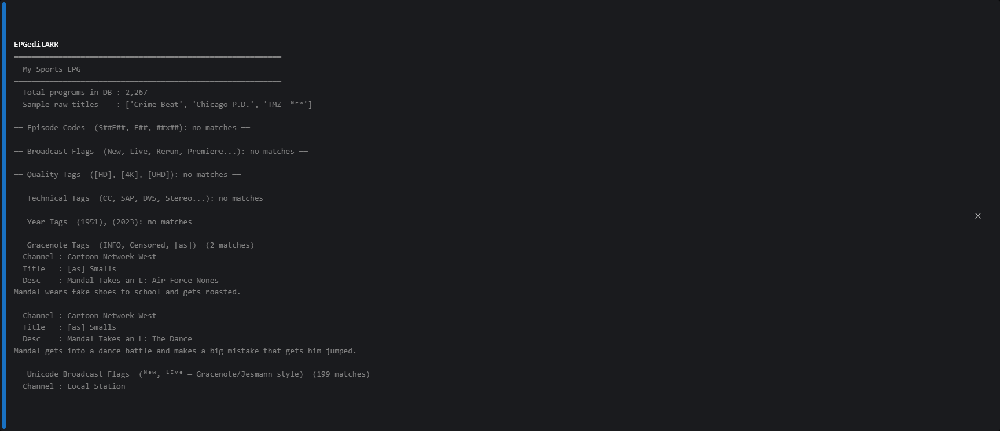
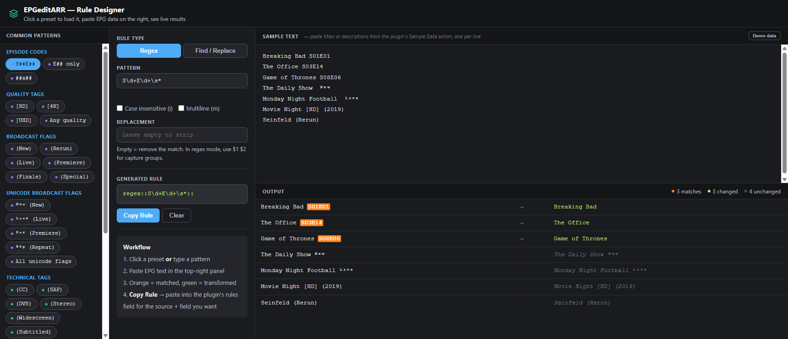
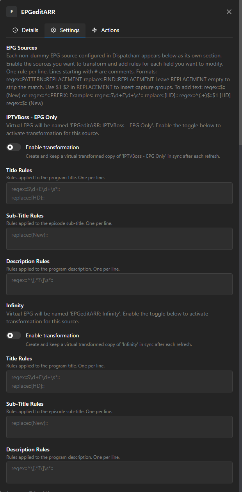
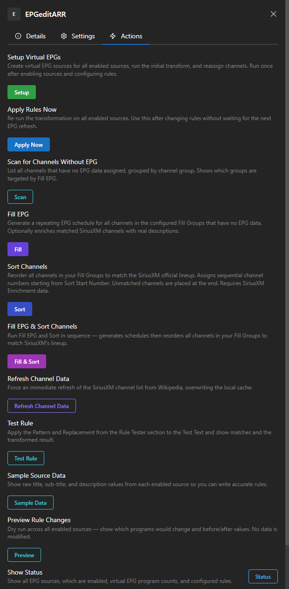
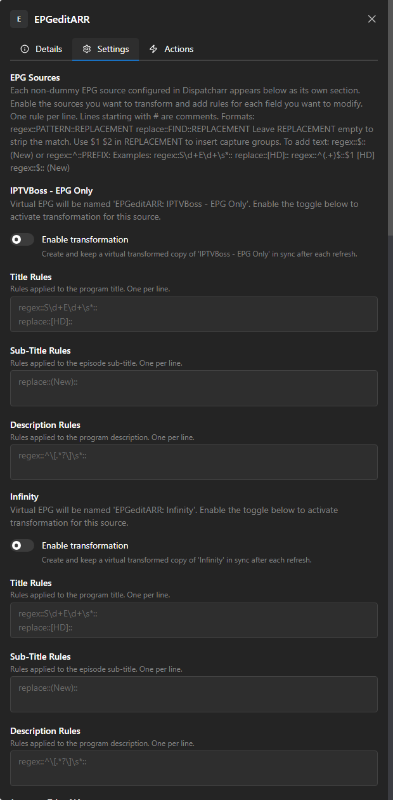
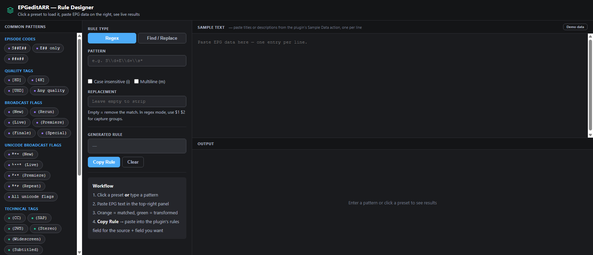

# EPGeditARR

A [Dispatcharr](https://github.com/Dispatcharr/Dispatcharr) plugin that creates clean, transformed copies of your EPG sources and fills in missing EPG data for channels that have none.

> **Think of it as a filter layer between your raw EPG feed and what your players see.** Original sources are never touched.

---

## What It Does

### EPG Transformation

Many EPG sources contain noise in program titles and descriptions: broadcast flags, quality tags, episode codes, and other artifacts injected by the data provider.

| Raw title (what your EPG contains) | After EPGeditARR |
|---|---|
| `The Daily Show  ᴺᵉʷ` | `The Daily Show` |
| `Breaking Bad S01E01` | `Breaking Bad` |
| `Movie Night [HD] (2019)` | `Movie Night (2019)` |
| `Live Sports [LIVE]` | `Live Sports` |

EPGeditARR creates a virtual copy of your EPG source and writes the transformed programs there. Your channels are reassigned automatically. The original EPG is left untouched.

### Fill EPG

For channels that have no EPG data at all, EPGeditARR can generate a repeating placeholder schedule. This gives every channel at least a title block in your TV guide instead of a blank entry.

### SiriusXM Support

For SiriusXM channel groups specifically, EPGeditARR can:
- **Enrich** generated EPG entries with real channel descriptions pulled from Wikipedia
- **Sort** your SiriusXM channels into SiriusXM's official lineup order, assigning sequential channel numbers starting from wherever your current range begins
- **Defer seasonal channels** automatically — holiday channels (e.g. SiriusXM Holly, Country Christmas) are placed at the end of the list when they're out of season, and sort to their correct lineup positions when active

The SiriusXM channel list is rebuilt weekly from Wikipedia by a GitHub Actions workflow and served from GitHub Pages — no load on your Dispatcharr server.

---



## Installation

### Recommended: Via Plugin Repository

1. In Dispatcharr, go to **Plugins → Find Plugins → Manage Repos → Add Repository**
2. Paste this URL:
   ```
   https://jstevenscl.github.io/epgeditarr/manifest.json
   ```
3. Click **Add Repo**, then find **EPGeditARR** in the list and install it

### Manual Install

Copy `plugin.py` and `plugin.json` into your Dispatcharr plugins directory and reload plugins.

---

## Quick Start — EPG Transformation

### Step 1 — Find out what's in your EPG

Before writing any rules, use **Sample Data** to see what tags and patterns actually exist in your sources.

1. Open EPGeditARR → **Actions tab**
2. Click **Sample Data**

The output groups programs by category (episode codes, broadcast flags, quality tags, unicode flags, etc.) and shows real before/after examples.



### Step 2 — Build your rules

Use the **[Rule Designer](https://jstevenscl.github.io/epgeditarr/designer.html)** to pick rules from a preset library or build your own. Copy the generated rules text when you're done.



Common presets:
- Episode codes (`S01E01`, `E05`, `1x05`)
- Broadcast flags (`(New)`, `(Live)`, `(Repeat)`, `[LIVE]`)
- Quality tags (`[HD]`, `[4K]`, `[UHD]`)
- Technical tags (`(CC)`, `(SAP)`, `(Stereo)`)
- Year tags (`(2023)`)
- Unicode broadcast flags (`ᴺᵉʷ`, `ᴸᶦᵛᵉ` — Gracenote-based providers)

### Step 3 — Enable a source and add rules

1. Open EPGeditARR → **Settings tab**
2. Find the EPG source you want to clean
3. Toggle **Enable transformation** ON
4. Paste your rules into **Title Rules** (and/or Sub-Title / Description Rules)



### Step 4 — Preview (optional but recommended)

Click **Preview** in the Actions tab. Shows exactly which programs would change and the before/after values — no data is modified.

### Step 5 — Run Setup

Click **Setup** in the Actions tab. This:
- Creates a virtual EPG source (`EPGeditARR: [Your Source Name]`)
- Transforms all programs and writes them to the virtual source
- Reassigns your channels to the virtual source automatically



From this point on, **every EPG refresh automatically re-runs the transformation**. You never have to touch Setup again unless you add a new source.

---

## Quick Start — Fill EPG

Fill EPG generates a repeating placeholder schedule for channels that have no EPG data.

### Step 1 — Configure Fill Groups

In **Settings → Fill EPG**, enter the names of the channel groups you want to fill (comma-separated). Example: `SiriusXM, Radio`.

Also set **Block Duration** (how long each placeholder program block is) and **Days Ahead** (how many days of schedule to generate).

### Step 2 — Scan to see what will be filled

Click **Scan** in the Actions tab. This shows all channels with no EPG data, grouped by channel group, and marks which groups are targeted by Fill EPG.

### Step 3 — Fill

Click **Fill** to generate the schedules. Channels in your Fill Groups that have no EPG get a repeating block schedule. This runs automatically after every EPG refresh.

---

## Quick Start — SiriusXM Channels

> All SiriusXM features are in **Settings → SiriusXM Channels Only** section and use the **Sort**, **Fill & Sort**, and **Refresh Channel Data** actions.



### Enrichment (real descriptions)

1. In **Settings → SiriusXM Channels Only**, enable **Enable SiriusXM Enrichment**
2. Make sure your SiriusXM group name is in **Fill Groups**
3. Run **Fill** or **Fill & Sort** — matched channels get their real descriptions in the generated EPG

Channel names are matched case-insensitively with fuzzy fallbacks for common variations (leading quotes, `The ` prefix, `SiriusXM ` vs `Sirius XM ` prefix differences, `&` vs `and`, trailing ` Radio`/` Channel`). The channel list is refreshed from Wikipedia weekly via GitHub Actions and cached locally for 7 days.

### Sorting (match SiriusXM's lineup order)

1. Leave **Sort Start Number** blank to auto-detect from your current channel range, or enter a specific starting number
2. Click **Sort** (or **Fill & Sort** to do both at once)

Channels are renumbered sequentially in SiriusXM's official lineup order. The output shows a clear breakdown:

```
Sort complete — 445 channels renumbered from 3258 (auto-detected)

  Matched via Wikipedia      : 200
  Seasonal (out of season)   : 13
  Matched via sport block    : 124
  Matched via name number    : 60
  No match (placed at end)   : 48

Seasonal channels (out of season — will sort correctly when active):
  Holly
  Country Christmas
  Hallmark Radio
  ...

Channels with no lineup match (placed at end):
  Limited Edition 10
  Alt2K
  ...
```

**Seasonal channels** are placed at the end while out of season and automatically sort to their correct Wikipedia lineup positions when the season begins — no manual intervention needed.

**Sport play-by-play channels** (NFL, NBA, NHL, MLB team feeds) are grouped with their league's block using a built-in team roster.

**Embedded channel numbers** (e.g. `Sports 963`, `ACC 955`) are used as a fallback sort key for channels not in the Wikipedia lineup.

---

## Actions Reference

| Button | What it does |
|---|---|
| **Setup** | First time you enable a source, or after adding a new source. Creates the virtual EPG and reassigns channels. |
| **Apply Now** | After changing rules — re-runs the transform immediately without waiting for the next EPG refresh. |
| **Scan** | List all channels with no EPG data, grouped by channel group. Shows which groups are targeted by Fill EPG. |
| **Fill** | Generate repeating placeholder EPG schedules for channels in your Fill Groups with no EPG data. |
| **Sort** | *(SiriusXM)* Reorder channels in your Fill Groups to match SiriusXM's official lineup order. |
| **Fill & Sort** | *(SiriusXM)* Run Fill and Sort together in one step. |
| **Refresh Channel Data** | *(SiriusXM)* Force an immediate refresh of the SiriusXM channel list from Wikipedia. |
| **Sample Data** | Discover what tags/patterns exist in your sources. Run this before writing rules. |
| **Preview** | Dry-run your current rules. Shows before/after for affected programs. No changes made. |
| **Test Rule** | Test a single rule against live data from any source and field. Uses the Rule Tester settings. |
| **Status** | Shows which sources are enabled, program counts, Fill EPG status, and configured rules. |
| **Teardown** | Removes all virtual EPG sources (including Fill EPG) and reassigns channels back to their originals. |

---

## Rule Format

Rules go in the **Title Rules**, **Sub-Title Rules**, or **Description Rules** fields in Settings. One rule per line. Lines starting with `#` are comments.

### Regex rule
```
regex::PATTERN::REPLACEMENT
```
- `PATTERN` is a Python regex
- Leave `REPLACEMENT` empty to strip the match entirely
- Use `$1`, `$2` for capture groups (EPGeditARR converts these to `\1`, `\2` internally)

### Find/replace rule
```
replace::FIND::REPLACEMENT
```
- Literal text match (not a regex)
- Leave `REPLACEMENT` empty to strip the match

### Examples

Strip episode codes from titles:
```
regex::S\d+E\d+\s*::
regex::\bE\d{2,3}\b\s*::
```

Strip broadcast flags:
```
regex::\s*\(New\)\s*::
regex::\s*\(Live\)\s*::
regex::\s*\[LIVE\]\s*::
```

Strip quality tags:
```
replace::[HD]::
replace::[4K]::
```

Strip unicode broadcast flags (Gracenote-style):
```
regex::\s{2,}(?:ᴺᵉʷ|ᴸᶦᵛᵉ|ᴾʳᵉ|ᴿᵉᵖ|ᴵⁿᶠᵒ|ᴼᵛᵉʷ)::
```

Strip a year from the end of a title:
```
regex::\s*\((19|20)\d{2}\)\s*$::
```

### Adding tags

Inject text by anchoring to the start (`^`) or end (`$`) of a field:

```
regex::$:: [LIVE]
regex::^::ESPN: 
```

Conditionally add `[LIVE]` only when the title contains the word "live":
```
regex::^(.*\blive\b.*)$::$1 [LIVE]
```

> **Tip:** Use the **Inject / Add Tags** preset group in the Rule Designer to build these without typing regex by hand.

---

## Settings Reference

### EPG Sources

Each EPG source in Dispatcharr gets its own section. Per-source settings:

| Setting | Description |
|---|---|
| **Enable transformation** | Toggle transformation on/off for this source |
| **Title Rules** | Rules applied to program titles |
| **Sub-Title Rules** | Rules applied to episode sub-titles |
| **Description Rules** | Rules applied to program descriptions |
| **Auto-Reassign Channels on Setup** | Toggle channel reassignment on/off for this source |
| **Include Channel Groups** | Comma-separated group names — only these groups are reassigned |
| **Exclude Channel Groups** | Comma-separated group names — these groups are skipped |

### Fill EPG

| Setting | Description |
|---|---|
| **Fill Groups** | Comma-separated channel group names. Channels in these groups with no EPG get a generated schedule. |
| **Skip Channels** | One channel name per line. These channels are excluded from Fill EPG even if in a Fill Group. |
| **Block Duration** | Duration of each generated program block (1–24 hours). |
| **Days Ahead** | How many days of schedule to generate ahead (7, 14, or 30). |

### SiriusXM Channels Only

| Setting | Description |
|---|---|
| **Enable SiriusXM Enrichment** | Match channel names against the Wikipedia lineup and add real descriptions to generated EPG entries. Also required for Sort to function. |
| **Sort Start Number** | Channel number for the first sorted channel. Leave blank to auto-detect from the lowest number currently in your Fill Groups. |

---

## Rule Tester

The Rule Tester lets you test a single rule against live data from any source without modifying anything.

1. Go to **Settings tab** → scroll to **Rule Tester**
2. Select the source and field (Title, Sub-Title, or Description)
3. Enter a pattern and optional replacement
4. Click **Test Rule** in the Actions tab

You can also paste specific text into **Test Text** to test against that instead of pulling live data.

---

## Rule Designer

The **[Rule Designer](https://jstevenscl.github.io/epgeditarr/designer.html)** is a standalone web tool for building rules visually.

- Browse the preset library and add rules with one click
- Test patterns against sample text in real time
- Copy the finished rules text and paste into the plugin settings



---

## FAQ

**Do my original EPG sources get modified?**
No. EPGeditARR only writes to the virtual (dummy) EPG sources it creates. Your original sources are read-only.

**What happens when my EPG refreshes?**
The plugin listens for Dispatcharr's EPG refresh completion signal. When a source you've enabled finishes refreshing, the transform and Fill EPG both run automatically.

**I added a new source after running Setup. What do I do?**
Enable the new source in Settings, add rules, then click **Setup** again. It's safe to run multiple times — it won't duplicate virtual sources or reassign already-correct channels.

**I changed my rules. Do I need to run Setup again?**
No — click **Apply Now**. Setup is only needed when adding a new source for the first time.

**Something looks wrong. How do I undo everything?**
Click **Teardown**. This deletes all virtual EPG sources (including Fill EPG) and reassigns your channels back to their original sources.

**My SiriusXM channel didn't get a description even though enrichment is on.**
The Fill output shows how many channels matched. If a channel missed, the most common cause is a name difference between your Dispatcharr channel and SiriusXM's Wikipedia listing. Run **Refresh Channel Data** to pull the latest list. The Sort output also lists every unmatched channel by name to help you investigate.

**Why are my holiday channels at the end of the sort even though they have Wikipedia numbers?**
Channels in SiriusXM's seasonal holiday section (active early November – early January) are automatically placed at the end of the list when they're out of season. They'll sort to their correct positions — Holly at #4, Country Christmas at #58, etc. — as soon as the season begins. No action needed.

**The unicode broadcast flags (`ᴺᵉʷ`, `ᴸᶦᵛᵉ`) show zero matches in Sample Data.**
These are provider-specific — not all EPG sources include them. Use Sample Data with each enabled source individually to find which one has them. They're typically found in Gracenote-sourced or aggregator feeds.

**How does the SiriusXM channel list stay up to date?**
A GitHub Actions workflow rebuilds `channels.json` from Wikipedia every Monday and commits it to the repo. It's served via GitHub Pages so your Dispatcharr server never has to hit Wikipedia directly. You can also force a refresh any time with **Refresh Channel Data**.

---

## License

MIT
