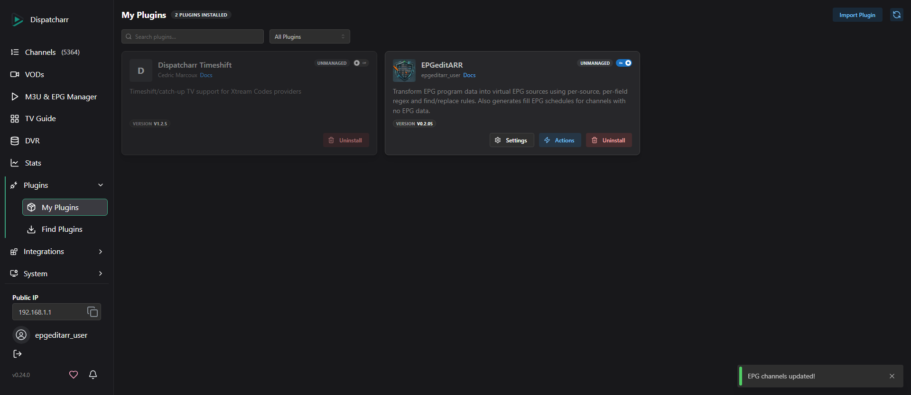
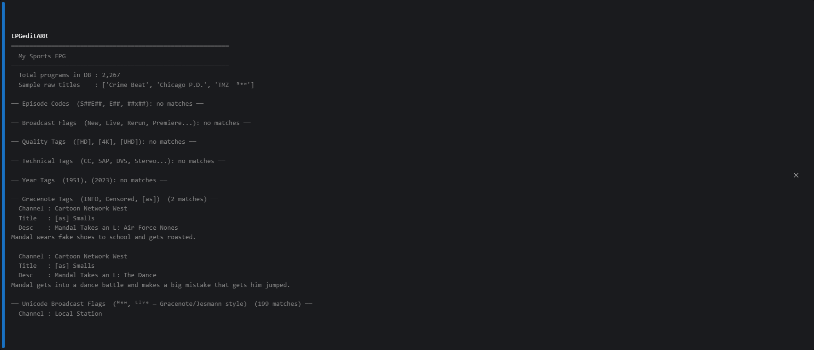
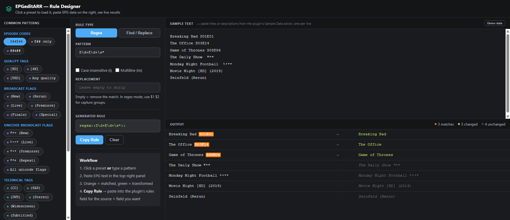
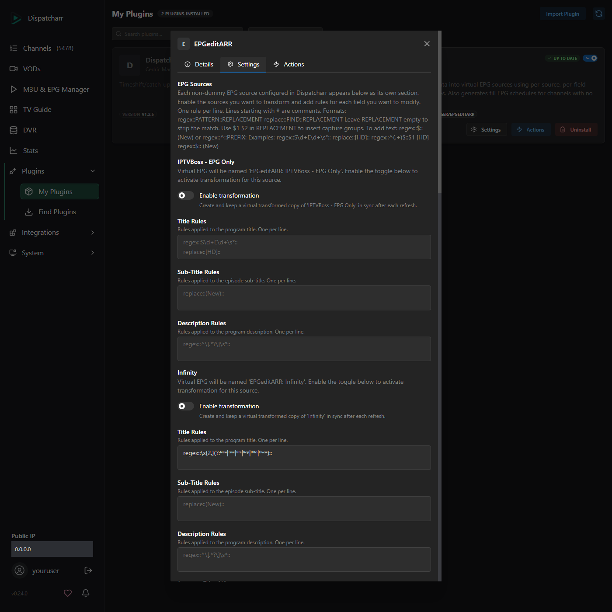
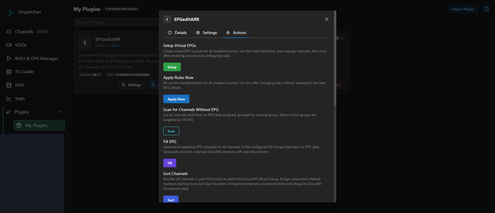
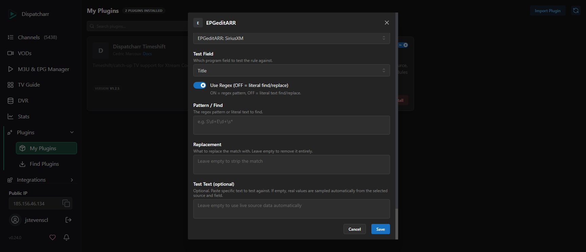
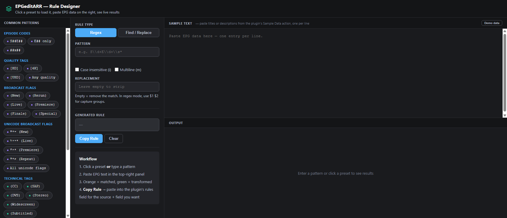

# EPGeditARR

A [Dispatcharr](https://github.com/Dispatcharr/Dispatcharr) plugin that creates clean, transformed copies of your EPG sources, fills in missing EPG data, and provides a full SiriusXM channel management toolkit.

> **Think of it as a filter layer between your raw EPG feed and what your players see.** Original sources are never touched.

---

## What It Does

### EPG Transformation

Many EPG sources contain noise in program titles and descriptions: broadcast flags, quality tags, episode codes, and other artifacts injected by the data provider.

| Raw title (what your EPG contains) | After EPGeditARR |
|---|---|
| `The Daily Show  ᴺᵉʷ` | `The Daily Show` |
| `Breaking Bad S01E01` | `Breaking Bad` |
| `Movie Night [HD] (2019)` | `Movie Night (2019)` |
| `Live Sports [LIVE]` | `Live Sports` |

EPGeditARR creates a virtual copy of your EPG source and writes the transformed programs there. Your channels are reassigned automatically. The original EPG is left untouched.

Per-source, you can also **Force Category (Series Mode)** and **Synthesize Episode Numbers From Air Date** — useful when an EPG's bare-bones programs (title/description only, no episode data) get treated as duplicate movies by Plex instead of recordable series episodes. See Settings Reference below.

### Fill EPG

For channels that have no EPG data at all, EPGeditARR can generate a repeating placeholder schedule. This gives every channel at least a title block in your TV guide instead of a blank entry.

### SiriusXM Tools

For SiriusXM channel groups specifically, EPGeditARR provides a complete channel management toolkit:

- **Fill EPG** — Downloads the community SiriusXM XMLTV directly and assigns real EPG to every channel in your SiriusXM group in one step — no separate EPG refresh needed. Sports channels (NFL, NBA, MLB, NHL, Soccer, NASCAR, PGA Tour, IndyCar, F1) get smart schedule blocks: Upcoming announcements before each game, a LIVE block during the game, and a Post-game block after. All other channels get repeating fill blocks with real SiriusXM descriptions.
- **Sort** — Reorder your SiriusXM channels into SiriusXM's official lineup order. Sequential mode (default) assigns numbers starting from wherever your current range begins, packed with no gaps; Absolute mode sets each channel's trailing digits to its real SXM station number (e.g. start 15000 + station 36 -> 15036), optionally prefixed onto the channel name too — see Settings Reference for the required Numbering Block Size and other details
- **Rename Channels** — Rename channels in your group to their official SiriusXM names, correcting provider name variants automatically using a built-in alias library
- **Assign Logos** — Assign channel logos to every matched SiriusXM channel from a self-hosted logo cache (667 logos, served via GitHub Pages — no third-party CDN dependency)
- **Defer seasonal channels** — Holiday channels (e.g. Holly, Country Christmas) are placed at the end of the list when out of season, and sort to their correct lineup positions when active
- **Fill, Sort & Logos** — Run all three SiriusXM setup steps in one click

The SiriusXM channel list is sourced from the [rebrowser/siriusxm-dataset](https://github.com/rebrowser/siriusxm-dataset) public CSV (updated daily, no credentials required) and rebuilt weekly by a GitHub Actions workflow, served from GitHub Pages — no load on your Dispatcharr server.

### Community SiriusXM EPG

EPGeditARR publishes a ready-to-use XMLTV EPG file covering all SiriusXM channels — no plugin required. Add it directly to any IPTV player or DVR that accepts an XMLTV URL:

```
https://jstevenscl.github.io/epgeditarr/siriusxm_epg.xml
```

- **771 channels** — all SiriusXM channels from the official lineup plus sport play-by-play feeds
- **Sports channels** get smart blocks: Upcoming → LIVE → Post-game
- **All other channels** get repeating fill blocks with real SiriusXM descriptions
- **14 days** of schedule generated, refreshed every 4 hours
- **Channel logos** included via `<icon>` tags for matched channels
- Set your channel's `tvg-id` to the SiriusXM channel name (e.g. `SiriusXM NFL Radio`, `SiriusXM NBA Radio`) to match the EPG

---



## Installation

### Recommended: Via Plugin Repository

1. In Dispatcharr, go to **Plugins → Find Plugins → Manage Repos → Add Repository**
2. Paste this URL:
   ```
   https://jstevenscl.github.io/epgeditarr/manifest.json
   ```
3. Click **Add Repo**, then find **EPGeditARR** in the list and install it

### Manual Install

Copy `plugin.py` and `plugin.json` into your Dispatcharr plugins directory and reload plugins.

---

## Quick Start — EPG Transformation

### Step 1 — Find out what's in your EPG

Before writing any rules, use **Sample Data** to see what tags and patterns actually exist in your sources.

1. Open EPGeditARR → **Actions tab**
2. Click **Sample Data**

The output groups programs by category (episode codes, broadcast flags, quality tags, unicode flags, etc.) and shows real before/after examples.



### Step 2 — Build your rules

Use the **[Rule Designer](https://jstevenscl.github.io/epgeditarr/designer.html)** to pick rules from a preset library or build your own. Copy the generated rules text when you're done.



Common presets:
- Episode codes (`S01E01`, `E05`, `1x05`)
- Broadcast flags (`(New)`, `(Live)`, `(Repeat)`, `[LIVE]`)
- Quality tags (`[HD]`, `[4K]`, `[UHD]`)
- Technical tags (`(CC)`, `(SAP)`, `(Stereo)`)
- Year tags (`(2023)`)
- Unicode broadcast flags (`ᴺᵉʷ`, `ᴸᶦᵛᵉ` — Gracenote-based providers)

### Step 3 — Enable a source and add rules

1. Open EPGeditARR → **Settings tab**
2. Find the EPG source you want to clean
3. Toggle **Enable transformation** ON
4. Paste your rules into **Title Rules** (and/or Sub-Title / Description Rules)



### Step 4 — Preview (optional but recommended)

Click **Preview** in the Actions tab. Shows exactly which programs would change and the before/after values — no data is modified.

### Step 5 — Run Setup

Click **Setup** in the Actions tab. This:
- Creates a virtual EPG source (`EPGeditARR: [Your Source Name]`)
- Transforms all programs and writes them to the virtual source
- Reassigns your channels to the virtual source automatically



From this point on, **every EPG refresh automatically re-runs the transformation**. You never have to touch Setup again unless you add a new source.

---

## Quick Start — Fill EPG

Fill EPG generates a repeating placeholder schedule for channels that have no EPG data.

### Step 1 — Configure Fill Groups

In **Settings → Fill EPG**, enter the names of the channel groups you want to fill (comma-separated). Example: `SiriusXM, Radio`.

Also set **Block Duration** (how long each placeholder program block is) and **Days Ahead** (how many days of schedule to generate).

### Step 2 — Scan to see what will be filled

Click **Scan** in the Actions tab. This shows all channels with no EPG data, grouped by channel group, and marks which groups are targeted by Fill EPG.

### Step 3 — Fill

Click **Fill** to generate the schedules. Channels in your Fill Groups that have no EPG get a repeating block schedule. This runs automatically after every EPG refresh.

---

## Quick Start — SiriusXM Channels

> All SiriusXM features operate on the **SiriusXM Channel Group** configured in **Settings → SiriusXM Channels Only** — completely separate from the general Fill Groups setting.



### Step 1 — Enable Enrichment

In **Settings → SiriusXM Channels Only**, enable **Enable SiriusXM Enrichment** and set your **SiriusXM Channel Group** name. This loads the official SiriusXM channel data needed for all SiriusXM actions.

### Step 2 — Rename Channels (optional but recommended)

Click **Rename Channels** to correct any provider name variants. EPGeditARR uses a built-in alias library that maps known mislabeled or old channel names (e.g. "Green Day's Idiot Nation" → "FACTION PUNK", "VSiN Radio" → "VSiN") to their official SiriusXM names. Only matched channels are renamed.

### Step 3 — Fill, Sort & Assign Logos

Click **Fill, Sort & Logos** to run all three steps at once:

1. **Fill SiriusXM EPG** — Downloads the community XMLTV and assigns EPG with real SiriusXM channel descriptions to all matched channels in your SiriusXM Channel Group
2. **Sort Channels** — Reorders channels to match SiriusXM's official lineup order and assigns sequential channel numbers
3. **Assign Logos** — Assigns channel logos from the self-hosted GitHub Pages logo cache

Or run each step individually with the dedicated action buttons.

> **Note — timeout / gateway error on Fill:** The fill downloads ~200 MB of EPG data and can take over 60 seconds. If your reverse proxy (nginx, Traefik, Caddy, etc.) has a short timeout, the browser may show a **504 Gateway Timeout** or similar error before the response arrives. **This does not mean the fill failed** — the backend keeps running after the browser connection drops. Click **Show Status** after a minute to confirm. If it reports channel entries and programs, the fill completed successfully.

#### Sorting output example

```
Sort complete — 312 channels renumbered from 1001 (auto-detected)

  Matched via SiriusXM API   : 148
  Seasonal (out of season)   :  11
  Matched via sport block    :  96
  Matched via name number    :  38
  No match (placed at end)   :  19

Seasonal channels (out of season — will sort correctly when active):
  Holly
  Country Christmas
  Hallmark Radio
  ...
```

**Seasonal channels** are placed at the end while out of season and automatically sort to their correct lineup positions when the season begins — no manual intervention needed.

**Sport play-by-play channels** (NFL, NBA, NHL, MLB team feeds) are grouped with their league's block using a built-in team roster.

**Embedded channel numbers** (e.g. `Sports 963`, `ACC 955`) are used as a fallback sort key for channels not in the official SiriusXM lineup.

#### Unmatched channel log

Any channel name that couldn't be matched to the SiriusXM lineup is automatically logged to plugin settings and shown in the **Status** action output:

```
Unmatched channel names (3) — copy and share to grow alias list:
  Infinity Sports Network
  My Custom Station
  Sports Extra
```

Copy and share these names if you want them added to the alias library in a future update.

---

## Actions Reference

| Button | What it does |
|---|---|
| **Setup** | First time you enable a source, or after adding a new source. Creates the virtual EPG and reassigns channels. |
| **Apply Now** | After changing rules — re-runs the transform immediately without waiting for the next EPG refresh. |
| **Preview** | Dry-run your current rules. Shows before/after for affected programs. No changes made. |
| **Sample Data** | Discover what tags/patterns exist in your sources. Run this before writing rules. |
| **Test Rule** | Test a single rule against live data from any source and field. Uses the Rule Tester settings. |
| **Scan** | List all channels with no EPG data, grouped by channel group. Shows which groups are targeted by Fill EPG. |
| **Fill** | Generate repeating placeholder EPG schedules for channels in your Fill Groups with no EPG data. |
| **Fill SiriusXM EPG** | *(SiriusXM)* Download the community SiriusXM XMLTV and assign EPG to all channels in your SiriusXM Channel Group. Sports channels get smart Upcoming/LIVE/Post-game blocks; all other channels get repeating fill blocks with real SiriusXM descriptions. Creates the `EPGeditARR: SiriusXM` source automatically if it doesn't exist. ⚠️ Downloads ~200 MB — may take 60+ seconds. If a timeout/gateway error appears, run **Show Status** to verify the fill completed. |
| **Sort** | *(SiriusXM)* Reorder channels in your SiriusXM Channel Group to match SiriusXM's official lineup order. |
| **Fill & Sort** | *(SiriusXM)* Run Fill SiriusXM EPG and Sort together in one step. ⚠️ See Fill SiriusXM EPG note on timeouts. |
| **Fill, Sort & Logos** | *(SiriusXM)* Run Fill SiriusXM EPG, Sort, and Assign Logos in one step — the full SiriusXM setup. ⚠️ See Fill SiriusXM EPG note on timeouts. |
| **Rename Channels** | *(SiriusXM)* Rename channels in your SiriusXM Channel Group to their official SiriusXM names using the built-in alias library. |
| **Assign Logos** | *(SiriusXM)* Assign channel logos from the self-hosted GitHub Pages logo cache to matched channels. |
| **Refresh Channel Data** | *(SiriusXM)* Force an immediate refresh of the SiriusXM channel list from the GitHub Pages cache. |
| **Show Status** | Shows which sources are enabled, program counts, Fill EPG status, configured rules, and any unmatched channel names accumulated since last review. |
| **Teardown** | Removes all virtual EPG sources (including Fill EPG) and reassigns channels back to their originals. |

---

## Rule Format

Rules go in the **Title Rules**, **Sub-Title Rules**, or **Description Rules** fields in Settings. One rule per line. Lines starting with `#` are comments.

### Regex rule
```
regex::PATTERN::REPLACEMENT
```
- `PATTERN` is a Python regex
- Leave `REPLACEMENT` empty to strip the match entirely
- Use `$1`, `$2` for capture groups (EPGeditARR converts these to `\1`, `\2` internally)

### Find/replace rule
```
replace::FIND::REPLACEMENT
```
- Literal text match (not a regex)
- Leave `REPLACEMENT` empty to strip the match

### Examples

Strip episode codes from titles:
```
regex::S\d+E\d+\s*::
regex::\bE\d{2,3}\b\s*::
```

Strip broadcast flags:
```
regex::\s*\(New\)\s*::
regex::\s*\(Live\)\s*::
regex::\s*\[LIVE\]\s*::
```

Strip quality tags:
```
replace::[HD]::
replace::[4K]::
```

Strip unicode broadcast flags (Gracenote-style):
```
regex::\s{2,}(?:ᴺᵉʷ|ᴸᶦᵛᵉ|ᴾʳᵉ|ᴿᵉᵖ|ᴵⁿᶠᵒ|ᴼᵛᵉʷ)::
```

Strip a year from the end of a title:
```
regex::\s*\((19|20)\d{2}\)\s*$::
```

### Adding tags

Inject text by anchoring to the start (`^`) or end (`$`) of a field:

```
regex::$:: [LIVE]
regex::^::ESPN: 
```

Conditionally add `[LIVE]` only when the title contains the word "live":
```
regex::^(.*\blive\b.*)$::$1 [LIVE]
```

> **Tip:** Use the **Inject / Add Tags** preset group in the Rule Designer to build these without typing regex by hand.

---

## Settings Reference

### EPG Sources

Each EPG source in Dispatcharr gets its own section. Per-source settings:

| Setting | Description |
|---|---|
| **Enable transformation** | Toggle transformation on/off for this source |
| **Title Rules** | Rules applied to program titles |
| **Sub-Title Rules** | Rules applied to episode sub-titles |
| **Description Rules** | Rules applied to program descriptions |
| **Force Category (Series Mode)** | Adds an XMLTV `<category>` tag to every program on this source's virtual copy. Setting this to `Series` tells Plex to treat repeating programs that share a title as episodes of a show instead of duplicate movies, so DVR can record more than one. Comma-separated for multiple categories. Leave blank to disable. |
| **Synthesize Episode Numbers From Air Date** | Adds a unique `<episode-num system="xmltv_ns">` tag per program, derived from its air date (year + day-of-year), so Plex sees each airing as a distinct episode instead of collapsing same-titled programs into one recordable movie. Pair with Force Category above. |
| **Auto-Reassign Channels on Setup** | Toggle channel reassignment on/off for this source |
| **Include Channel Groups** | Comma-separated group names — only these groups are reassigned |
| **Exclude Channel Groups** | Comma-separated group names — these groups are skipped |

### Fill EPG

| Setting | Description |
|---|---|
| **Fill Groups** | Comma-separated channel group names. Channels in these groups with no EPG get a generated schedule. |
| **Skip Channels** | One channel name per line. These channels are excluded from Fill EPG even if in a Fill Group. |
| **Block Duration** | Duration of each generated program block (1–24 hours). |
| **Days Ahead** | How many days of schedule to generate ahead (7, 14, or 30). |

### SiriusXM Channels Only

| Setting | Description |
|---|---|
| **Enable SiriusXM Enrichment** | Match channel names against the SiriusXM channel database and add real descriptions to generated EPG entries. Required for Sort, Rename, and Assign Logos to function. |
| **SiriusXM Channel Group** | The Dispatcharr channel group containing your SiriusXM channels. All SiriusXM actions operate on this group exclusively. |
| **Sort Start Number** | Channel number for the first sorted channel. Leave blank to auto-detect from the lowest number currently in your SiriusXM Channel Group. |
| **Numbering Mode** | Sequential (default, no gaps) or Absolute (channel number = Sort Start Number + real SiriusXM station number, e.g. 15000 + station 36 -> 15036). Absolute mode only offsets channels with a confirmed SiriusXM API station number — sport-block and name-guessed matches are placed sequentially instead, since their position isn't a real station number. Set Sort Start Number explicitly every run when using Absolute. |
| **Numbering Block Size** | **Required when Numbering Mode is Absolute.** Reserves Sort Start Number through Start+BlockSize-1 for this channel group, so channels with no station match never drift into whatever you numbered next. SiriusXM's full catalog runs up to station 1999, but real-world provider lineups are almost entirely ≤999 — confirmed against a live 431-channel provider feed, where 99.8% of matched channels fell at or below 999, with a single rare outlier near 1999. A block size of 1000 comfortably covers a typical lineup with zero overflow. A matched channel whose real station number falls outside your block still gets its correct absolute number (never silently moved) and is called out in the result message; unmatched channels that don't fit inside the block are placed just past it and flagged the same way. Channels with no station match (including the losing side of a duplicate-name match) are always placed starting right after your highest real matched station, never in the low numbers below it — SXM's own numbering starts at station 2, so those low slots are reserved for real stations, not backfilled with placeholder content. |
| **Prefix Channel Name With Station Number** | When on, Sort renames each channel with its SiriusXM station number as a prefix, in the format chosen below. Only applied to channels with a confirmed SiriusXM API station number. Safe to re-run — an existing prefix is replaced, not stacked. |
| **Station Number Prefix Format** | Zero-Padded (`036 Alt Nation`, minimum 3 digits, never truncated for 4+ digit stations) or No Leading Zeros (`36 Alt Nation`). Only used when the prefix setting above is on. |

---

## Rule Tester

The Rule Tester lets you test a single rule against live data from any source without modifying anything.

1. Go to **Settings tab** → scroll to **Rule Tester**
2. Select the source and field (Title, Sub-Title, or Description)
3. Enter a pattern and optional replacement
4. Click **Test Rule** in the Actions tab

You can also paste specific text into **Test Text** to test against that instead of pulling live data.

---

## Rule Designer

The **[Rule Designer](https://jstevenscl.github.io/epgeditarr/designer.html)** is a standalone web tool for building rules visually.

- Browse the preset library and add rules with one click
- Test patterns against sample text in real time
- Copy the finished rules text and paste into the plugin settings



---

## FAQ

**Do my original EPG sources get modified?**
No. EPGeditARR only writes to the virtual (dummy) EPG sources it creates. Your original sources are read-only.

**What happens when my EPG refreshes?**
The plugin listens for Dispatcharr's EPG refresh completion signal. When a source you've enabled finishes refreshing, the transform and Fill EPG both run automatically.

**I added a new source after running Setup. What do I do?**
Enable the new source in Settings, add rules, then click **Setup** again. It's safe to run multiple times — it won't duplicate virtual sources or reassign already-correct channels.

**I changed my rules. Do I need to run Setup again?**
No — click **Apply Now**. Setup is only needed when adding a new source for the first time.

**Something looks wrong. How do I undo everything?**
Click **Teardown**. This deletes all virtual EPG sources (including Fill EPG) and reassigns your channels back to their original sources.

**My SiriusXM channel didn't get a description even though enrichment is on.**
The Fill output shows how many channels matched and lists any unmatched names. If a channel missed, the most common cause is a name difference between your Dispatcharr channel and the official SiriusXM channel name. Run **Refresh Channel Data** to pull the latest data, or use **Rename Channels** to correct provider name variants first. Unmatched names are also saved and shown in the **Status** output so you can review them anytime.

**Rename Channels changed a name I didn't want changed.**
The rename is based on a built-in alias library that maps known provider variants to official SiriusXM names. If a match is wrong, the channel can be manually renamed back in Dispatcharr. You can also run **Rename Channels** selectively — only matched channels are renamed, unmatched ones are left alone.

**Why are my holiday channels at the end of the sort?**
Channels in SiriusXM's seasonal holiday section (active early November – early January) are automatically placed at the end of the list when they're out of season. They'll sort to their correct positions — Holly at #4, Country Christmas at #58, etc. — as soon as the season begins. No action needed.

**Why does Absolute numbering mode require a Numbering Block Size?**
Absolute mode sets each channel's trailing digits to its real SXM station number — but SiriusXM's full catalog runs up to station 1999, and unmatched channels need a reserved range to fill into that won't drift into whatever you numbered next. Rather than guess a default, EPGeditARR requires you to set it explicitly (1000 comfortably covers a typical lineup — real provider data shows ~99.8% of channels at or below 999). A matched channel whose real station number falls outside your block still gets its correct absolute number and is called out in the result message, never silently moved.

**Is it safe to run Sort multiple times with Prefix Channel Name enabled?**
Yes. Matching strips any existing station-number prefix before comparing against the SiriusXM dataset, so a channel already renamed to "036 Alt Nation" still matches "Alt Nation" and stays correctly positioned on every subsequent run — including Rename Channels and Assign Logos, which use the same matching.

**Two of my channels both matched the same station number. What happens?**
Only the first one keeps that station's real absolute number; the other is placed in the fill pool instead of colliding on the same channel number, and both are named explicitly in the result message so you can investigate (usually a duplicate SD/HD channel from your provider, or two channels that are genuinely the same station).

**Where do channels with no station match end up?**
Right after your highest real matched station — never in the low numbers below it. SXM's own numbering starts at station 2, so those low slots are reserved for real stations and are never backfilled with unmatched or duplicate-loser content, even if they're technically free. This also applies to the losing side of a duplicate-name match above.

**The unicode broadcast flags (`ᴺᵉʷ`, `ᴸᶦᵛᵉ`) show zero matches in Sample Data.**
These are provider-specific — not all EPG sources include them. Use Sample Data with each enabled source individually to find which one has them. They're typically found in Gracenote-sourced or aggregator feeds.

**How does the SiriusXM channel list stay up to date?**
A GitHub Actions workflow pulls the latest channel list from the [rebrowser/siriusxm-dataset](https://github.com/rebrowser/siriusxm-dataset) public CSV (updated daily, no credentials required) every week and commits it to the repo. It's served via GitHub Pages so your Dispatcharr server never hits any external API directly. You can also force a refresh any time with **Refresh Channel Data**.

**Where do the channel logos come from?**
SiriusXM channel logos are downloaded from the official SiriusXM player CDN and cached in this repository, served via GitHub Pages. Currently 667 channels have logos cached. There is no dependency on any third-party logo service.

**Some of my channels show as unmatched. What does that mean?**
Channels that can't be matched to the official SiriusXM lineup are logged automatically. You can see them any time by clicking **Status**. Unmatched channels are usually provider-specific name variants, abbreviations, or recently added channels not yet in the alias library. If you share the names (copy from Status output), they can be added as aliases in a future update.

**Fill SiriusXM EPG showed a 504 Gateway Timeout / gateway error — did it fail?**
Almost certainly not. The fill downloads ~200 MB of EPG data and rewrites hundreds of channels, which can take 60–90+ seconds. Most reverse proxies (nginx, Traefik, Caddy) drop the browser connection after 60 seconds by default — but the Dispatcharr backend (Gunicorn) keeps running and finishes the job. The browser error is the proxy giving up, not the fill failing. Click **Show Status** after a minute or two: if it shows channel entries and program counts, the fill completed successfully. You don't need to run it again.

**I updated Dispatcharr and now plugin action buttons don't show any output.**
This is a known display-only regression in Dispatcharr v0.25.0. When you click an action button (Status, Fill, Sort, etc.) the action runs correctly on the backend and all data is written — the result text just doesn't render in the modal UI. To confirm an action completed, click **Show Status** which will show current program counts and source state. All functionality (EPG transform, Fill EPG, SiriusXM Fill, Sort, Logos) continues to work normally. No change to EPGeditARR is needed.

---

## License

MIT
