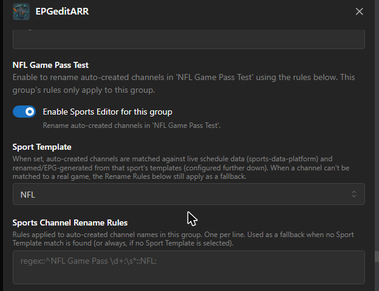
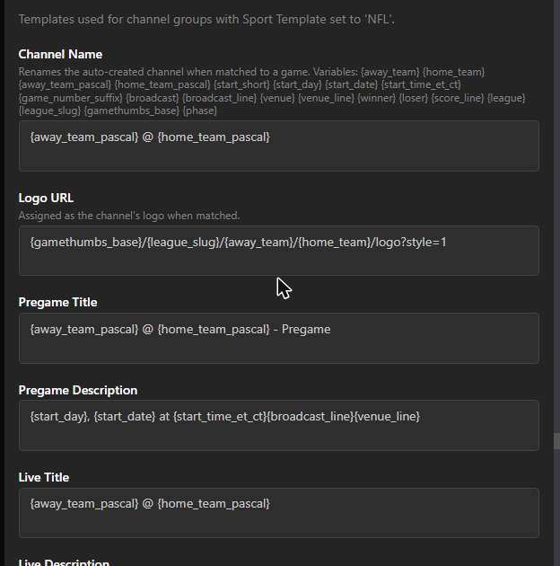

# Sport Templates Guide

A step-by-step walkthrough for turning auto-created sports channels into fully renamed, logo'd channels with real Pregame/Live/Postgame EPG data — driven by a public live sports schedule.

> This feature builds on the [Sports Editor](../README.md#sports-editor)'s per-channel-group Rename Rules. If you haven't set those up yet, do that first — see the README's [Quick Start — Sports Editor](../README.md#quick-start--sports-editor).

---

## How it works, in one paragraph

Dispatcharr's **Auto Channel Sync** creates channels automatically from an M3U stream group (e.g. an "NFL Game Pass" group), usually named whatever the provider calls the stream — often something like `NFL Game Pass 03: Denver Broncos at Atlanta Falcons`. Right after that sync finishes, EPGeditARR parses each auto-created channel's name into an away/home matchup, looks it up against a live public schedule feed ([sports-data-platform](https://api.tickarr.com)), and — if it finds a confident match — renames the channel, assigns it a matchup logo, and writes three real EPG program blocks (Pregame, Live, Postgame) using templates you define once per sport. If no confident match is found, your regular Rename Rules still apply as a fallback.

---

## Prerequisites

1. **Auto Channel Sync configured** in Dispatcharr for the M3U stream group you want (see the main README's Sports Editor Quick Start, Step 1).
2. **Sports Editor enabled for that channel group**, with the toggle on (Settings → find your group's section).
3. That's it — Sport Templates piggyback on the same per-group section; there's no separate enable step.

---

## Step 1 — Enable the Sports Editor for your channel group

In EPGeditARR's Settings tab, scroll to the **SPORTS EDITOR** section. Find your channel group (e.g. "NFL Game Pass Test") and toggle **Enable Sports Editor for this group** on.



## Step 2 — Pick a Sport Template

In that same group's section, set **Sport Template** to the sport this group carries (NFL, NBA, MLB, NHL, NCAA Football, or MLS). Leave it at **(none — regex rules only)** if you just want the plain Rename Rules behavior with no live-schedule matching.

> **Sport Templates and Rename Rules are not mutually exclusive.** If a channel can't be confidently matched to a real game (wrong team names, no game currently in the schedule window, etc.), your group's Rename Rules still run as a fallback. If a Sport Template match *is* found, the Sport Template's Channel Name always wins over the regex rules for that channel.

## Step 3 — Review (or customize) that sport's templates

Scroll down to the **SPORT TEMPLATES** section — one sub-section per sport, shared across every group that selects it (templates are defined once per sport, not per group). Each sport has 8 fields:

| Field | Used for |
|---|---|
| **Channel Name** | Renames the matched channel |
| **Logo URL** | Assigned as the channel's logo |
| **Pregame Title** / **Pregame Description** | EPG block covering midnight UTC through kickoff on game day |
| **Live Title** / **Live Description** | EPG block covering the estimated game window |
| **Postgame Title** / **Postgame Description** | EPG block covering 1 hour after the estimated end |

Every field comes pre-filled with a sensible starter template (see [Starter Templates Per League](#starter-templates-per-league) below) — you don't have to touch anything to get a working result. Customize any field using the `{variable}` syntax described next.



## Step 4 — Run it

- **Automatically**: nothing to do — it runs right after every successful M3U refresh, immediately after Rename Rules.
- **Manually / right now**: go to the Actions tab and click **Run Sport Templates Now**. This is the fastest way to test a template change without waiting for the next refresh.

The result message shows per-group match counts and a few example renames:

```
Sports Editor EPG: 3 channel(s) matched to live games across 1 group(s), 3 auto-created channel(s) scanned.
NFL Game Pass Test (NFL): scanned 3, matched 3
  'NFL: Denver Broncos at Atlanta Falcons' -> 'Denver Broncos @ Atlanta Falcons'
  ...
```

> **Note:** On some Dispatcharr versions (a known display-only regression, present since v0.25.0), the result text above doesn't render in the Actions modal even though the action ran and wrote all its data correctly. If clicking **Run Sport Templates** doesn't visibly show anything, click **Show Status** instead to confirm — or just check your TV Guide/Channels list directly.

> **Don't use Dispatcharr's own per-source refresh icon (⟳) in M3U & EPG Manager on the "EPGeditARR: Sports Editor" or "EPGeditARR: Fill" rows.** These sources deliberately have no URL — EPGeditARR writes their program data directly instead of Dispatcharr fetching it — so Dispatcharr's native refresh will always fail with something like "Failed to download EPG data, cannot parse programs." **This is expected and harmless**: it only flips the source's cosmetic Status column to "Error," it never touches or deletes your actual EPG data. Use **Run Sport Templates Now** (or **Fill**, or **Apply Now**) in the plugin's own Actions tab instead — those are the only actions that should ever be used to refresh EPGeditARR-managed data, and running any of them again immediately restores the Status column to "Success."

## Step 5 — Check your TV Guide

Matched channels show up in your TV Guide with the Pregame/Live/Postgame blocks for their real game — including the game-thumbs logo you configured. A channel whose game is still days away will simply show its next-scheduled blocks like any other future EPG entry.

---

## The matching engine, explained

You don't need to understand this to use the feature, but it helps when a channel *doesn't* match the way you expect.

1. **Parsing the matchup.** EPGeditARR splits the channel's current name (after Rename Rules, if any ran first) on the words `@`, `vs`, `v`, or `at` — so `Denver Broncos at Atlanta Falcons` becomes away=`Denver Broncos`, home=`Atlanta Falcons`. If a channel's name doesn't contain one of those separators, it's skipped (no matchup to look up).
2. **Fetching the schedule.** The full live schedule feed from `api.tickarr.com` is cached for 30 minutes, so repeated refreshes don't hammer the API.
3. **Scoring candidates.** Every event in the feed for the selected league is scored against both the away and home team text (exact match, substring match, and fuzzy text similarity). **Both sides must independently score well** — a strong match on one team and a weak/unrelated match on the other is rejected, not averaged into a false positive.
4. **Time window.** Only events starting within roughly the last 20 hours to the next 10 days are considered — wide enough to catch a game that just ended (so a Postgame recap can still show) without matching something from weeks ago.
5. **Dead-game guard.** If the matched game's entire window — including its 1-hour Postgame block — has already fully elapsed, it's treated as *no match*. This prevents writing EPG data that's already 100% in the past by the time anyone looks at the guide; your Rename Rules fallback applies instead.
6. **No match found?** The channel is left as-is (after Rename Rules, if configured) and simply isn't touched by the Sport Template step. It'll be re-evaluated on the next run — most commonly, this resolves itself once your M3U provider updates the stream to reflect an upcoming game.

---

## Full Variable Reference

All of these are available in every template field (Channel Name, Logo URL, and all six title/description fields):

| Variable | Example | Notes |
|---|---|---|
| `{away_team}` | `den` | URL-safe slug (team abbreviation, lowercased) — use in Logo URL |
| `{home_team}` | `atl` | Same, for the home team |
| `{away_team_pascal}` | `Denver Broncos` | Full readable team name — use in titles/descriptions |
| `{home_team_pascal}` | `Atlanta Falcons` | Same, for the home team |
| `{start_short}` | `7:00 PM` | Kickoff time, Eastern |
| `{start_day}` | `Friday` | Day of week, Eastern |
| `{start_date}` | `Aug 14` | Month + day, Eastern |
| `{start_time_et_ct}` | `7:00 PM ET / 6:00 PM CT` | Both US timezones in one string |
| `{start_short_utc}` | `11:00 PM` | Kickoff time, UTC — timezone-neutral alternative to `{start_short}` |
| `{start_day_utc}` | `Friday` | Day of week, UTC |
| `{start_date_utc}` | `Aug 14` | Month + day, UTC |
| `{start_time_utc}` | `11:00 PM UTC` | Timezone-neutral alternative to `{start_time_et_ct}` |
| `{game_number_suffix}` | ` (Game 2)` | Blank unless the feed marks a game number (doubleheaders, etc.) |
| `{broadcast}` | `ESPN Unlmtd, KUSA-TV (9NEWS)` | Raw broadcast field from the feed, blank if unknown |
| `{broadcast_line}` | ` on ESPN Unlmtd, KUSA-TV (9NEWS)` | Pre-formatted with leading " on " — blank (not just empty) when no broadcast info exists, so your sentence doesn't end with a dangling " on " |
| `{venue}` | `Mercedes-Benz Stadium, Atlanta` | Venue name + city, blank if unknown |
| `{venue_line}` | ` at Mercedes-Benz Stadium, Atlanta` | Pre-formatted with leading " at " |
| `{winner}` | `Denver Broncos` | Blank until the game has a final score |
| `{loser}` | `Atlanta Falcons` | Same |
| `{score_line}` | `Final: Denver Broncos 24 - Atlanta Falcons 17` | Blank until the game has a final score — used in Postgame Description |
| `{league}` | `NFL` | Full league name from the feed |
| `{league_slug}` | `nfl` | Short slug — matches the game-thumbs league path |
| `{gamethumbs_base}` | `https://game-thumbs.tickarr.com` | Your configured Game Thumbs Base URL, trailing slash stripped |
| `{phase}` | `pregame` / `live` / `postgame` | Which of the three blocks is being rendered — mostly useful if you want one shared template across phases |

**Tip:** `{broadcast_line}` and `{venue_line}` already include their own leading space and connector word — just append them directly to a sentence, don't add your own " on " / " at " in front of them.

**UTC vs. ET/CT — what's actually timezone-dependent and what isn't:**
- The **stored program times** (where each block starts/ends in your TV Guide) are always UTC, same as everything else in Dispatcharr's database — this is fully timezone-neutral and works correctly for viewers anywhere in the world regardless of which time-format variables you use in your templates.
- The **`{start_short}` / `{start_day}` / `{start_date}` / `{start_time_et_ct}` variables** are US Eastern/Central-formatted text, since that's the broadcast-standard convention for the leagues SDP covers (NFL, NBA, MLB, NHL, NCAA, MLS are all US sports). Use the `_utc` variants (`{start_short_utc}`, `{start_day_utc}`, `{start_date_utc}`, `{start_time_utc}`) instead if you'd rather your titles/descriptions read in UTC.

---

## Game Thumbs & Logo URL Parameters

The default Logo URL template uses [sethwv/game-thumbs](https://github.com/sethwv/game-thumbs), a self-hostable matchup logo/thumbnail API:

```
{gamethumbs_base}/{league_slug}/{away_team}/{home_team}/logo?style=1
```

- **`{gamethumbs_base}`** — set once in **Settings → Sports Editor → Game Thumbs Base URL**. Defaults to a publicly hosted instance; point it at your own self-hosted instance if you run one.
- **`{league_slug}`** — the sport's league path (`nfl`, `nba`, `mlb`, `nhl`, `ncaa-football`, `mls`).
- **`{away_team}` / `{home_team}`** — team abbreviation slugs (`den`, `atl`, etc.).
- **`?style=1`** — game-thumbs supports multiple visual styles; check its README for the current list and swap the number to taste. You can also use its `/thumb` endpoint instead of `/logo` for a wider matchup graphic instead of a single team crest — e.g. `{gamethumbs_base}/{league_slug}/{away_team}/{home_team}/thumb`.

### Using the public default instance

Nothing to do — **Game Thumbs Base URL** already defaults to a publicly hosted instance, and Logo URL templates work out of the box. This is fine for most users; skip straight to [Starter Templates Per League](#starter-templates-per-league).

### Self-hosting your own game-thumbs instance

Reasons to self-host: you want guaranteed uptime independent of a third party, you're customizing thumbnail styles, or you just prefer not depending on an external service for something that shows up in your guide constantly.

1. **Deploy the container.** [sethwv/game-thumbs](https://github.com/sethwv/game-thumbs) ships a standard Docker image — follow its own README for the current `docker run` / `docker-compose.yml` invocation. A minimal setup is a single container exposing its HTTP port; no database or persistent volume is required.
2. **Make it reachable from wherever your guide renders.** This is the detail people miss: the URL needs to be reachable not just from the Dispatcharr *server*, but from every device/browser/app that actually displays your TV guide (since the guide client fetches the logo image directly, not proxied through Dispatcharr). A container port only reachable inside your home network won't work for a phone on cellular data, for example. Options, roughly in order of effort:
   - **Reverse proxy + real domain** (what EPGeditARR's own public default instance uses): put the container behind Caddy/Nginx/Traefik on a subdomain, with a real TLS cert.
   - **Cloudflare Tunnel**: no port-forwarding or public IP needed, works well for a home server. Give the tunnel its own isolated Docker network from your other services if you're running multiple containers, so a compromise of one doesn't expose the others.
   - **LAN-only**: fine if every device viewing your guide is always on the same network (e.g. a single Plex/Jellyfin server on your home LAN with no remote access) — just use the container's local IP/port directly.
3. **Point EPGeditARR at it.** Settings → Sports Editor → **Game Thumbs Base URL** → your instance's base URL (no trailing slash, e.g. `https://game-thumbs.example.com`). This one setting applies to every sport's Logo URL template, since they all reference `{gamethumbs_base}`.
4. **Verify it.** Open `{your-base-url}/nfl/kc/buf/logo?style=1` (swap in any real team abbreviations) directly in a browser — you should get an image back, not an error. If that works, click **Run Sport Templates Now** and check a matched channel's logo in Channels or the TV Guide.

---

## Starter Templates Per League

These are the built-in defaults — a good base to start from and adjust. All six leagues share the same Channel Name and Logo URL pattern; only the assumed game duration (used to size the Live block) differs under the hood.

### NFL / NBA / MLB / NHL / NCAA Football / MLS (shared starting point)

| Field | Default template |
|---|---|
| Channel Name | `{away_team_pascal} @ {home_team_pascal}` |
| Logo URL | `{gamethumbs_base}/{league_slug}/{away_team}/{home_team}/logo?style=1` |
| Pregame Title | `{away_team_pascal} @ {home_team_pascal} - Pregame` |
| Pregame Description | `{start_day}, {start_date} at {start_time_et_ct}{broadcast_line}{venue_line}` |
| Live Title | `{away_team_pascal} @ {home_team_pascal}` |
| Live Description | `Live: {away_team_pascal} at {home_team_pascal}{broadcast_line}{venue_line}` |
| Postgame Title | `{away_team_pascal} @ {home_team_pascal} - Final` |
| Postgame Description | `{score_line}{venue_line}` |

### Estimated game duration (sizes the Live block only — not user-editable, informational)

| League | Assumed duration |
|---|---|
| NFL | 3.5 hours |
| NBA | 2.5 hours |
| MLB | 3.25 hours |
| NHL | 2.75 hours |
| NCAA Football | 3.5 hours |
| MLS | 2.25 hours |

Every game gets a Pregame block running from midnight **UTC** on game day through kickoff (so a game-dedicated channel shows as "pregame" for the whole day, not just the hour before) and a 1-hour Postgame block after the estimated end, regardless of league. The boundary is anchored to UTC rather than a US timezone deliberately — Dispatcharr itself is timezone-neutral, and EPGeditARR is used by viewers worldwide, not just in the US.

### Ideas for customizing per league

- **NCAA Football** — team names can be long; consider a shorter Channel Name like `{away_team} @ {home_team}` (using the slug instead of the full name) if your guide truncates titles.
- **MLB** — add `{game_number_suffix}` to Channel Name to distinguish doubleheaders: `{away_team_pascal} @ {home_team_pascal}{game_number_suffix}`.
- **Any league** — swap `@` for `vs.` in Channel Name if you prefer that convention: `{away_team_pascal} vs. {home_team_pascal}`.

---

## Troubleshooting

**A channel never gets matched.**
Run **Run Sport Templates Now** and check the result message — it reports scanned vs. matched counts per group. Common causes: the channel's raw/renamed name doesn't contain a recognizable `@`/`vs`/`at` separator; the two team names are too different from the feed's naming (try checking the raw provider name against team abbreviations); or there's simply no game for that exact matchup in the current schedule window (most common for a channel representing a game that already happened days ago and won't recur soon).

**A channel matched, but nothing shows in the TV Guide.**
Check the game's actual kickoff time — if the entire Pregame→Postgame window has already passed, EPGeditARR intentionally skips it rather than writing dead data (see [step 5 of the matching engine](#the-matching-engine-explained)). It'll pick up the channel's next real game automatically once your M3U provider updates the stream.

**Logo doesn't load.**
Confirm your Game Thumbs Base URL is reachable from wherever your player renders the guide (not just from the Dispatcharr server) — if you're self-hosting game-thumbs, it needs to be publicly reachable, not just container-internal.

**I changed a template and want to see the new EPG text without waiting.**
Click **Run Sport Templates Now** — it always regenerates all three blocks fresh for every currently-matched channel using your latest saved templates.

**Clicking the refresh icon (⟳) next to "EPGeditARR: Sports Editor" in M3U & EPG Manager gives an error about the source URL.**
Expected — see the note in [Step 4](#step-4--run-it) above. That row intentionally has no URL. Use **Run Sport Templates Now** in the plugin's Actions tab instead; your real EPG data was never affected.

---

## Credits

- The per-sport template UX (Channel Name / Logo URL / Pregame / Live / Postgame fields) was inspired by [Pharaoh-Labs' Teamarr](https://github.com/Pharaoh-Labs/teamarr), used with permission.
- Matchup logos/thumbnails via [sethwv/game-thumbs](https://github.com/sethwv/game-thumbs) (MIT), used with permission.
- Schedule data via [sports-data-platform](https://api.tickarr.com).
